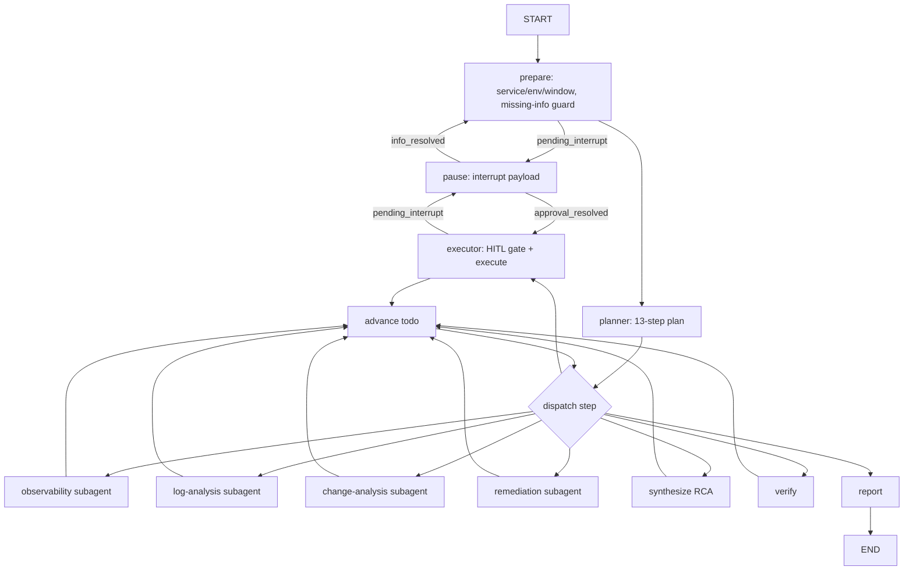

# AegisOps Architecture

## 1. Layered view

```
┌──────────────────────────────────────────────────────────────────┐
│ FastAPI :8090                                                     │
│  /api/chat  /api/chat/stream (SSE)  /api/chat/{id}/resume        │
│  /api/history  /api/threads/{id}/state  /api/traces  /api/scenarios│
└──────────────┬───────────────────────────────────────────────────┘
               │ MiddlewareStack (10 pluggable middlewares)
┌──────────────▼───────────────────────────────────────────────────┐
│ LangGraph Incident Response Graph (checkpointed, interruptable)  │
│  prepare → planner → dispatch loop:                              │
│    observability / log-analysis / change-analysis / remediation  │
│  → synthesize(RCA) → executor(HITL) → pause → verify → report    │
└──────┬──────────────────┬───────────────────┬────────────────────┘
       │                  │                   │
  ModelAdapter      ToolRegistry        Sandbox chain
  (OpenAI-compat    (risk L0-L3,         health → manager → proxy
   or FakeLLM)       policy, breaker)    → backend protocol
       │                  │                   │
       │            MCPToolAdapter      DockerSandboxBackend (prod)
       │            (FastMCP boundary)  LocalSandboxBackend (dev fallback)
       │                  │
       │            OpsProvider (MockOpsProvider, future Prometheus/Loki/K8s)
       │
  Memory / Skills (progressive disclosure + safe installer)
```

## 2. LangGraph flow



Every edge between nodes is a LangGraph superstep; `interrupt()` only happens inside
`pause`, and the interrupt payload is written to state *before* pausing so SSE
interrupt detection is deterministic.

## 3. Context isolation invariant

- Main-agent `messages` channel: system policy + user turns + compressed tail.
- `subagent_reports`: one Pydantic `SubAgentReport` per specialist.
- `transcripts`: raw subagent tool results. **Never read by
  `assemble_main_messages()`** — enforced by code and by the integration test
  that injects raw logs and asserts the main LLM never sees them.
- `ContextCompressor` offloads old main turns above a token threshold while
  decisions/evidence/plan/unresolved hypotheses live in separate state fields.

## 4. HITL & checkpointing

1. `prepare` writes `pending_interrupt{type: missing_info}` and routes to `pause`.
2. `pause` calls LangGraph `interrupt(payload)`; the run suspends and the HTTP
   SSE stream ends with an `interrupt` + `done(interrupted=true)` event.
3. `POST /api/chat/{thread_id}/resume` invokes `Command(resume={supplement|decisions})`.
4. `pause` re-executes at the same checkpoint, parses the resume payload,
   clears `pending_interrupt`, and routes back (info → `prepare`, approval → `executor`).
5. Approval decisions are recorded in the `decisions` channel. `executor` only
   calls high-risk tools with `approved=True` after a decision exists.
6. SQLite checkpointer (default) makes the interrupt survive a process restart;
   `tests/integration/test_checkpoint_resume.py` proves it.

## 5. Sandbox five components

| Component | Responsibility |
|---|---|
| `SandboxHealthMiddleware` | before_run: ensure → ping → recover |
| `SandboxManager` | user→proxy map, prewarm/claim/cache/rebuild/destroy, seed files |
| `SandboxBackendProxy` | stable handle; `replace_backend()` hot swap |
| `SandboxBackend` protocol | create/connect/ping/execute/upload/download/destroy |
| `DockerSandboxBackend` / `LocalSandboxBackend` | real isolation / dev fallback |

Recovery path: `execute` raises → `SandboxCircuitBreaker` records failure →
`SandboxToolBridge` calls `manager.rebuild(proxy)` → `proxy.replace_backend()`
→ command retried → agent continues. Covered by `tests/failure/`.

## 6. Risk policy

| Level | Tools | Execution |
|---|---|---|
| L0 read-only | query_metrics/logs, health, topology, releases, catalog, verify | auto |
| L1 low-risk write | create_incident_ticket | auto or policy |
| L2 production-changing | restart_service, scale_service | HITL |
| L3 high-risk destructive | rollback_release, apply_config_change | HITL + reason + target + before-state + expected impact |

Subagent YAML configs may only reference tools with risk ≤ L1; the loader
rejects anything higher.

## 7. SSE protocol

`POST /api/chat/stream` streams `data: {json}\n\n` frames:

```
run_start | token | plan | agent_start | agent_end |
tool_start | tool_args | tool_result | tool_end |
interrupt | report | error | done
```

Two LangGraph stream modes are combined: `messages` (raw message/token chunks)
and `custom` (our structured event bus via `get_stream_writer()`). Tool events
are emitted by `TracingToolObserver` inside `ToolRegistry`, so every execution
path is visible without instrumenting each agent separately.

## 8. Evaluation

See `EVALUATION.md`. Same scenarios run through Single-Agent, Multi-Agent and
Harness runners; binary metrics use McNemar, continuous metrics use paired
bootstrap 95% CIs; every number in the repo comes from `eval_results/*`.
