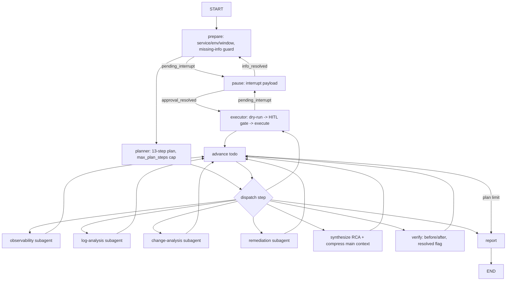

# AegisOps Architecture

## 1. Layered view

```
┌──────────────────────────────────────────────────────────────────┐
│ FastAPI :8090                                                     │
│  /api/chat  /api/chat/stream (SSE)  /api/chat/{id}/resume        │
│  /api/history  /api/threads/{id}/state  /api/traces  /api/scenarios│
└──────────────┬───────────────────────────────────────────────────┘
               │ MiddlewareStack (11 pluggable middlewares)
┌──────────────▼───────────────────────────────────────────────────┐
│ LangGraph Incident Response Graph (checkpointed, interruptable)  │
│  prepare → planner → dispatch loop:                              │
│    observability / log-analysis / change-analysis / remediation  │
│  → synthesize(RCA) → executor(dry-run + HITL) → pause → verify → report│
└──────┬──────────────────┬───────────────────┬────────────────────┘
       │                  │                   │
  ModelAdapter      ToolRegistry        Sandbox chain
  (OpenAI-compat    (risk L0-L3,         health → manager → proxy
   or FakeLLM,       policy, breaker,     → backend protocol
   hard call budget) PII redaction)           │
       │                  │            DockerSandboxBackend (prod)
       │            MCPToolAdapter     LocalSandboxBackend (dev fallback)
       │            (FastMCP boundary)
       │                  │
       │            OpsProvider (MockOpsProvider, future Prometheus/Loki/K8s)
       │
  Memory / Skills (progressive disclosure + safe installer)
```

## 2. LangGraph flow



## 3. Context isolation invariant

- Main-agent `messages`: system policy + user turns + compressed tail.
- `subagent_reports`: one Pydantic `SubAgentReport` per specialist.
- `transcripts`: raw subagent tool results. **Never read by
  `assemble_main_messages()`** — enforced by code and by the integration test
  that injects raw logs and asserts the main LLM never sees them.
- Every `EvidenceItem` carries `id/source/tool/timestamp/service/raw_ref`; the
  `RcaHypothesis` carries `supporting_evidence` / `contradicting_evidence` ids.
- Change Analysis outputs `temporal_correlation`, `correlation` and
  `causal_confidence`; the prompt and FakeLLM cap causal confidence without
  version-split/rollback evidence.

## 4. Context compression (actually triggered)

- `synthesize` calls `compress_main_context()` before the RCA LLM call.
- Protected facts: system prompt, `Evidence so far` block, last N turns.
- `context_stats` records `tokens_before / tokens_after / compression_ratio /
  offloaded_turns / preserved`; evaluation reports `mean_main_context_tokens`
  and the isolation ablation compares it.

## 5. HITL & checkpointing

1. `prepare` writes `pending_interrupt{type: missing_info}` and routes to `pause`.
2. `pause` calls LangGraph `interrupt(payload)`; the run suspends; SSE ends with
   `interrupt` + `done(interrupted=true)`.
3. `POST /api/chat/{thread_id}/resume` invokes `Command(resume={...})`.
4. `pause` re-executes at the same checkpoint, parses the resume payload,
   clears `pending_interrupt`, routes back.
5. Approval requests contain `reason/target_environment/before_state/
   expected_impact` **and a `dry_run`** (planned change, expected result,
   rollback method, risk). The executor only calls high-risk tools with
   `approved=True` after a recorded decision.
6. SQLite checkpointer (default) survives process restarts. Tests assert plan
   and tool-call counts do not re-run after resume.

## 6. Sandbox five components

| Component | Responsibility |
|---|---|
| `SandboxHealthMiddleware` | before_run: ensure → ping → recover |
| `SandboxManager` | user→proxy map, prewarm/claim/cache/rebuild/destroy, seed files, Docker→Local fallback |
| `SandboxBackendProxy` | stable handle; `replace_backend()` hot swap |
| `SandboxBackend` protocol | create/connect/ping/execute/upload/download/destroy |
| `DockerSandboxBackend` / `LocalSandboxBackend` | real isolation / dev fallback |

Recovery: execute raises → breaker records transition → bridge
`manager.rebuild(proxy)` → hot swap → retry. Covered by tests and evaluation.

## 7. Risk policy

| Level | Tools | Execution |
|---|---|---|
| L0 read-only | query_*/get_*/verify_*/dry_run_action | auto |
| L1 low-risk write | create_incident_ticket | auto or policy |
| L2 production-changing | restart_service, scale_service | HITL |
| L3 high-risk destructive | rollback_release, apply_config_change | HITL + reason + target + before-state + expected impact + dry-run |

Subagent YAML configs may only reference risk ≤ L1. Prompt injection in logs
cannot change the policy: it is enforced in `ToolRegistry.call()`, not in text.

## 8. SSE protocol

`POST /api/chat/stream` streams `data: {json}\n\n` frames. Every frame has:

```
event_type | type | run_id | thread_id | source | timestamp | sequence
```

Event types: `run_start token plan agent_start agent_end tool_start tool_args
tool_result tool_end interrupt report error done`. Sequence is monotonic per
connection; the UI drops duplicates/out-of-order frames. LangGraph streams in
`messages + custom` dual mode.

## 9. Reliability limits

- `model_call_limit` hard budget via `LimitedModelAdapter`; exhaustion degrades
  each node gracefully and still produces a partial report.
- `tool_call_limit` enforced in `ToolRegistry`.
- `max_plan_steps` marks extra steps `skipped` and routes to the report node.
- `max_delegation_depth` guard in every subagent node.
- Circuit breakers record every `CLOSED/OPEN/HALF_OPEN` transition.

## 10. Evaluation

See `EVALUATION.md`. 110 scenarios across 11 difficulty buckets; systems
Single / Multi / Multi-no-isolation / Harness / Harness-no-recovery; paired
McNemar for binary metrics, paired bootstrap 95% CI for continuous metrics;
per-bucket comparisons; every number stored in `eval_results/*`.
